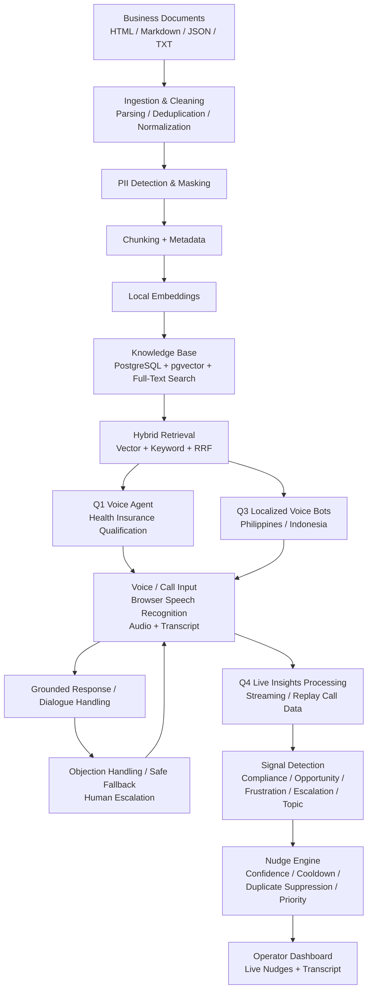

# AI Voice & Intelligence System

An AI system for financial and insurance conversations, combining a knowledge-grounded voice agent, a structured knowledge base, localized voice bots, and real-time call insights with operator nudges.

---

## Assignment Context

This project was originally built as part of a company AI Engineer assessment.

The initial implementation was created for the assessment submission. As I continue studying voice-agent engineering and related systems, I improve the project whenever I get time, using those studies to refine and extend the implementation incrementally.

The project is an evolving engineering and learning project built from an assessment baseline, rather than a claim of production readiness.

## Video Walkthrough

> https://github.com/user-attachments/assets/3e985527-6d07-4444-8023-aeaf99f320e9

The walkthrough demonstrates the voice agent, knowledge retrieval, multilingual voice bots, live insights, human escalation, evaluation results, and known limitations.

---

## System Architecture



The system connects business content, retrieval, voice interaction, localization, and real-time call intelligence into one workflow.

---

## Quick Start

```bash
git clone https://github.com/100NikhilBro/ai-voice-system.git
cd ai-voice-system

docker compose up -d
pip install -r requirements.txt

cp .env.example .env
# Configure .env

uvicorn src.main:app --reload
```

**Application:** `http://127.0.0.1:8000/`  
**API Documentation:** `http://127.0.0.1:8000/docs`

---

## Q1 — Knowledge-Grounded Voice Agent

A health-insurance lead qualification voice agent built around controlled conversation flow and knowledge retrieval.

### Capabilities

- Conversational lead qualification
- Qualification logic
- Knowledge-grounded responses
- Objection handling
- Incomplete or conflicting detail handling
- Out-of-scope fallback
- Human escalation
- Web-based voice interface
- Call transcripts and recordings

The voice agent is connected to the Q2 Knowledge Base for business and policy information rather than relying entirely on hardcoded FAQs and rules.

### Core Flow

```text
Customer
   ↓
Greeting
   ↓
Qualification
   ↓
Knowledge Query / Objection
   ↓
Qualified / Fallback
   ↓
Human Escalation when required
```

---

## Q2 — Knowledge Base

A searchable, structured, and traceable knowledge pipeline for mixed business content.

### Data Processing

- Document parsing and cleaning
- Duplicate and near-duplicate handling
- Terminology normalization
- PII detection and masking
- Chunking and metadata
- Version tracking
- Source tracking

### Retrieval

- PostgreSQL 16
- pgvector
- HNSW vector indexing
- PostgreSQL Full-Text Search
- Local Sentence Transformer embeddings
- Hybrid vector + keyword retrieval
- Reciprocal Rank Fusion
- Relevance ranking
- Source citations
- Safe fallback for unsupported queries

The retrieval layer returns traceable knowledge records with source information for grounded responses.

### Retrieval Benchmark

Covers Product, Policy, Qualification, FAQ, Objection, and Out-of-scope fallback.

---

## Q3 — Localized Voice Bots

Localized financial voice-bot prototypes for the Philippines and Indonesia.

### Philippines — Bancassurance

Supports English, Filipino / Tagalog, natural Taglish, insurance terminology, localized objections, market-specific tone and politeness, and customer-language fallback and escalation.

Example terminology:

`premium · policy · beneficiary · rider · lapse · coverage · bank referral`

### Indonesia — Multifinance

Supports formal Bahasa Indonesia, colloquial Bahasa Indonesia, finance-related English loanwords, regional speech testing, localized financial conversations, and customer-language fallback and escalation.

Example terminology:

`cicilan · tenor · denda · DP · jatuh tempo · angsuran · pembiayaan`

Localization covers language and register, code-switching, financial terminology, tone and politeness, dates and amounts, payment explanations, objection handling, and escalation behavior.

Detailed evaluation:

`docs/Q3_LOCALIZATION_REPORT.md`

### Localization Notes

Edge TTS is an external free TTS service rather than fully local TTS inference.

Indonesian regional-accent evaluation is documented as a proxy evaluation and is not presented as proof of authentic native regional-accent coverage.

---

## Q4 — Live Insights & Operator Nudges

A call-analysis pipeline that processes streamed or replayed call data and generates operator guidance.

### Pipeline

```text
Audio
  ↓
Streaming Transcription
  ↓
Signal Detection
  ↓
Nudge Engine
  ↓
WebSocket / API Delivery
  ↓
Operator Dashboard
```

### Detected Signals

- Compliance / risk
- Missed opportunities
- Buying signals
- Sentiment / frustration
- Escalation needs
- Topic changes

### Nudge Controls

- Confidence thresholds
- Duplicate suppression
- Cooldown
- Expiry
- Repetition limits
- Priority handling
- Topic grouping

Detailed implementation:

`docs/Q4_INSIGHTS_REPORT.md`

---

## Technology Stack

| Area | Technology |
|---|---|
| Backend | Python, FastAPI |
| Real-Time | WebSockets |
| Database | PostgreSQL 16 |
| Vector Search | pgvector, HNSW |
| Keyword Search | PostgreSQL Full-Text Search |
| Embeddings | Sentence Transformers |
| Retrieval | Hybrid Search, Reciprocal Rank Fusion |
| Voice | Browser Speech Recognition, Edge TTS |
| Frontend | HTML, CSS, JavaScript |
| Infrastructure | Docker, Docker Compose |

---

## Project Structure

```text
ai-voice-system/
├── src/
│   ├── api/
│   ├── ingestion/
│   ├── pii/
│   ├── retrieval/
│   ├── storage/
│   ├── voice/
│   └── insights/
├── domains/
│   ├── health_insurance/
│   ├── philippines_bancassurance/
│   └── indonesia_multifinance/
├── tests/
├── scripts/
├── artifacts/
│   ├── recordings/
│   └── q4_scenarios/
├── docs/
│   ├── ARCHITECTURE.md
│   ├── IMPLEMENTATION_PLAN.md
│   ├── REQUIREMENTS_MATRIX.md
│   ├── TECH_STACK.md
│   ├── TESTING_STRATEGY.md
│   ├── Q3_LOCALIZATION_REPORT.md
│   └── Q4_INSIGHTS_REPORT.md
├── web/
│   └── index.html
├── .env.example
├── docker-compose.yml
├── requirements.txt
└── README.md
```

---

## Main Interfaces

### Voice Agent

Live conversation, transcript, qualification state, call controls, grounded responses, and human escalation.

### Knowledge Base

Search, retrieved records, relevance information, source citations, and grounded / unsupported verdict.

### Live Insights

Signal detection, operator nudges, confidence, priority, latency information, and scenario replay.

---

## API & Real-Time Components

| Component | Endpoint |
|---|---|
| Health | `GET /health` |
| Voice Transcripts | `GET /api/v1/voice/transcripts` |
| Knowledge Base Search | `POST /api/v1/kb/search` |
| Voice WebSocket | `/ws/voice` |
| Live Insights WebSocket | `/api/v1/insights/ws/{session_id}` |
| Insights Replay | `POST /api/v1/insights/replay` |

---

## Testing & Verification

Automated coverage includes voice agent behavior, knowledge ingestion, PII masking, Q1 conversation scenarios, Q2 retrieval benchmarks, Q3 localization, ASR evaluation, Q4 signal detection, nudge generation, latency tracking, hybrid retrieval, and UI integration.

### Latest Regression

```text
53 passed
2 warnings
0 failures
```

### Q2 Retrieval Benchmark

Covers Product, Policy, Qualification, FAQ, Objection, and Out-of-scope fallback.

---

## Demo Scenarios

### Q1 — Voice Agent

```text
Customer
   ↓
Qualification
   ↓
Knowledge Query
   ↓
Objection Handling
   ↓
Human Escalation
```

Example escalation:

> `Please connect me to a human specialist.`

### Q2 — Knowledge Retrieval

```text
What are the age eligibility requirements for applicants?
```

```text
What does the Gold plan cover?
```

### Q3 — Philippines

```text
Magkano po ba ang monthly premium ng policy ko kung may rider?
```

### Q3 — Indonesia

```text
Udah transfer kemarin tapi kok dendanya masih nongol ya mas?
```

### Q4 — Live Insights

Includes scenarios for missed cross-sell, compliance / risk, rising frustration, and noisy or ambiguous conversations.

---

## Design Principles

**Grounded Responses**  
Business and policy information should come from retrieved knowledge.

**Traceability**  
Retrieved information is linked to source records and citations.

**Safe Fallback**  
Unsupported or unavailable information should not be invented.

**Human Escalation**  
Customers can be routed to a human specialist when required.

**Localization**  
Language adaptation includes terminology, tone, code-switching, and market-specific conversation behavior.

**Observability**  
Important processing stages expose measurable signals and latency information.

---

## Evidence

Test evidence and generated artifacts are stored under:

```text
artifacts/
```

Including Q1 call recordings and transcripts, Q3 localized recordings, Q4 replay scenarios, retrieval evaluation, localization evaluation, and latency measurements.

---

## Known Limitations

- Browser-based speech recognition depends on the runtime environment.
- Edge TTS is an external free TTS service rather than fully local TTS inference.
- Indonesian regional-accent evaluation is documented as a proxy evaluation.
- Voice and ASR quality can vary with microphone quality, background noise, pronunciation, and speech style.
- Additional hardening is required before production deployment.

---

## Security & Data Handling

- Secrets are stored through environment variables.
- `.env` is excluded from source control.
- PII is detected and masked during knowledge ingestion.
- Sample data is used for demonstration.
- Customer-sensitive production data should not be committed to the repository.

---

## Production Improvements

Potential next steps include dedicated streaming ASR infrastructure, native local TTS models, stronger speaker diarization, CRM integration, human handoff integrations, authentication and role-based access, distributed event processing, persistent observability, model evaluation and monitoring, automated regression benchmarks, rate limiting and abuse protection, production-grade secrets management, and horizontal scaling.

---

## Documentation

- `docs/ARCHITECTURE.md`
- `docs/IMPLEMENTATION_PLAN.md`
- `docs/REQUIREMENTS_MATRIX.md`
- `docs/TECH_STACK.md`
- `docs/TESTING_STRATEGY.md`
- `docs/Q3_LOCALIZATION_REPORT.md`
- `docs/Q4_INSIGHTS_REPORT.md`

---

This project started as a company AI Engineer assessment and continues to evolve as I study voice AI, retrieval, multilingual systems, and real-time AI engineering.
