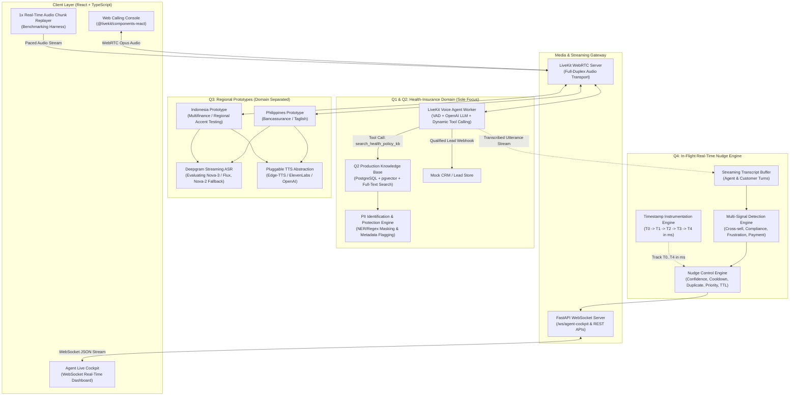
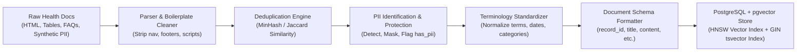
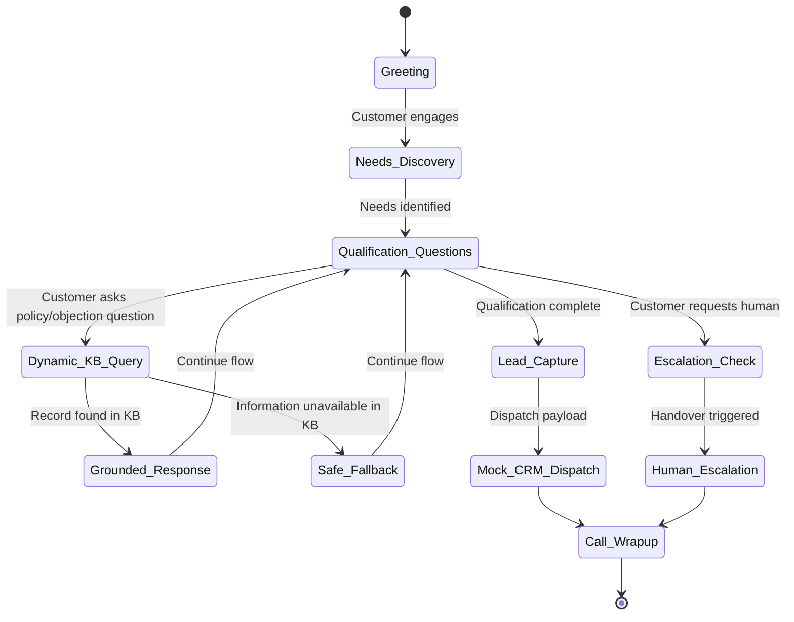
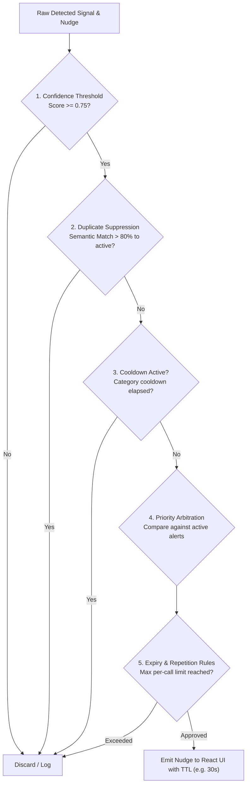

# System Architecture Document

## 1. System Overview

This architecture document specifies the end-to-end conversational AI and real-time audio intelligence platform designed under the constraints of the 48-hour AI Engineer Assessment.

The platform is structured into three cleanly decoupled architectural modules:
1. **Health-Insurance Core System (Questions 1 & 2)**: A specialized, knowledge-grounded voice agent built on **LiveKit Agents + WebRTC**, executing a structured lead qualification flow, powered by a **PostgreSQL + pgvector** hybrid knowledge base.
2. **Localized Regional Voice Prototypes (Question 3)**: Independent conversational prototypes tailored to Southeast Asian financial contexts: Philippines (Taglish Life Insurance / Bancassurance) and Indonesia (Bahasa Indonesia Multifinance with regional accent testing), evaluating **Deepgram (Nova-3 / Flux candidates, Nova-2 fallback)** and a **Pluggable TTS Provider Abstraction**.
3. **In-Flight Live Audio Nudge Engine (Question 4)**: A real-time streaming audio analytics pipeline processing live calls chunk-by-chunk to deliver actionable guidance to a **React + TypeScript** Agent Cockpit within seconds before the call ends, backed by practical timestamp instrumentation ($T_0 \dots T_4$) and multi-tier nudge suppression controls.

---

## 2. High-Level Architectural Diagram



---

## 3. Shared Primitives vs. Domain Isolation

The platform enforces a strict separation between **reusable streaming infrastructure** and **isolated business domains**:

```
c:/AI-Engineer-Assessment/
├── core/                         # Shared Reusable Infrastructure
│   ├── voice/                    # LiveKit agent definitions, WebRTC room manager, VAD
│   ├── asr/                      # Deepgram client (Nova-3/Flux candidates, Nova-2 fallback)
│   ├── tts/                      # TTS Provider Abstraction (Edge-TTS, ElevenLabs, OpenAI)
│   ├── llm/                      # OpenAI client, structured tool calling, prompt schemas
│   ├── db/                       # PostgreSQL connection pool & pgvector migrations
│   └── telemetry/                # Timestamp logger (T0-T4 in ms) & P50/P95 calculator
├── domains/
│   ├── health_insurance/         # Q1 & Q2 ONLY (Single Domain Focus)
│   │   ├── raw_docs/             # Messy source documents (HTML, tables, FAQs, synthetic PII)
│   │   ├── kb_pipeline/          # Extraction, cleaning, deduplication, PII protection
│   │   ├── schema.sql            # PostgreSQL + pgvector schema definition
│   │   ├── conversation_flow/    # Q1 Lead qualification dialogue logic & prompt
│   │   └── tools/                # Dynamic retrieval tool definition (search_health_policy_kb)
│   ├── philippines_bancassurance/# Q3 Prototype A (Philippines Life/Bancassurance)
│   │   ├── scripts/              # Taglish scripts, cultural markers (po/opo), referral flow
│   │   ├── lexicon/              # Tagalog/Taglish financial terminology dictionary
│   │   └── prompt/               # Philippines conversational prompt & objection rules
│   └── indonesia_multifinance/   # Q3 Prototype B (Indonesia Multifinance)
│       ├── scripts/              # Colloquial Bahasa & regional dialect scripts
│       ├── lexicon/              # Multifinance terminology dictionary (cicilan, tenor, etc.)
│       └── prompt/               # Indonesia installment reminder & collections prompt
├── nudge_engine/                 # Q4 In-Flight Real-Time Nudge Engine
│   ├── signals/                  # Signal detectors (cross-sell, compliance, frustration)
│   ├── controller/               # Cooldown, deduplication, confidence, priority, expiry
│   └── pipeline.py               # Streaming transcript orchestrator with latency hooks
└── frontend/                     # React + TypeScript Web Application
    ├── src/components/call/      # Web calling console (@livekit/components-react)
    └── src/components/cockpit/   # Live Agent Cockpit (nudge cards, latency chart)
```

---

## 4. Q1 & Q2: Health-Insurance Lead Qualification & Production Knowledge Base

### 4.1 Concrete Business Domain & Grounding Boundary
- **Single Business Focus [Assessment Requirement]**: Health-Insurance Lead Qualification is the sole domain for Q1 and Q2.
- **Strict Grounding Rule [Assessment Requirement]**:
  - The voice agent and knowledge base contain **zero assumed real-world policy facts**.
  - All policy rules, waiting periods, benefit limits, and exclusions exist **only if they are explicitly present in the ingested source documents**.
  - Any policy names, waiting period numbers, or sample medical conditions mentioned in documentation or test fixtures are **synthetic test placeholders**, strictly grounded in sample source files.
  - If a user asks a question about a policy or condition not covered in the ingested source files, the retrieval engine and voice bot **must state that the information is unavailable** instead of inventing an answer.

### 4.2 Q2 Knowledge Base Pipeline: Data Cleaning, Deduplication & PII Protection



#### PII Handling Strategy [Assessment Requirement]
The assessment requires identifying and protecting PII, rather than assuming business data is inherently PII-free:
1. **PII Identification**:
   - Automated detection using regex patterns and NER for: Full Names, Email Addresses, Phone Numbers, Identification Numbers, Physical Addresses.
2. **PII Protection & Transformation**:
   - **Masking / Tokenization**: Sensitive customer identifiers in sample documents or customer quotes are masked (e.g., `[CUSTOMER_NAME]`, `[PHONE_MASKED]`).
   - **Field-Level Isolation**: Protected attributes are scrubbed from the searchable index body.
   - **Schema Metadata Flagging**: Every record contains a boolean flag `has_pii: bool` and a classification list `pii_types_detected: list[str]`.
3. **Retrieval Policy**:
   - Search responses provided to the LLM agent have masking enabled by default.

#### Record Schema (PostgreSQL + pgvector)
```sql
CREATE TABLE health_kb_records (
    record_id VARCHAR(64) PRIMARY KEY,
    title VARCHAR(255) NOT NULL,
    content TEXT NOT NULL,
    category VARCHAR(64) NOT NULL,
    source VARCHAR(255) NOT NULL,
    version VARCHAR(16) NOT NULL DEFAULT '1.0',
    has_pii BOOLEAN NOT NULL DEFAULT FALSE,
    pii_types TEXT[] DEFAULT '{}',
    embedding vector(1536),
    tsv_content tsvector GENERATED ALWAYS AS (to_tsvector('english', title || ' ' || content)) STORED,
    metadata JSONB DEFAULT '{}',
    created_at TIMESTAMP WITH TIME ZONE DEFAULT CURRENT_TIMESTAMP
);
```

#### Hybrid Retrieval & Citation Engine [Engineering Decision]
- **Retrieval Mechanism**: Combines:
  1. Dense semantic search via `pgvector` HNSW cosine distance (`<=>`).
  2. Full-text search via PostgreSQL `ts_rank_cd` on `tsvector`.
  3. Reciprocal Rank Fusion (RRF) to merge ranks.
- **Traceable Citations**: Every retrieved result returns the exact `source` reference and `record_id`.
- **Unavailable Information Protocol**: If no chunk meets the relevance threshold ($\tau = 0.65$), the retriever explicitly returns an empty/unavailable response, instructing the voice agent to deliver the fallback statement.

### 4.3 Q1 Voice Agent Architecture & Conversation Flow



- **LiveKit Agent Orchestration [Engineering Decision]**: Implemented using LiveKit Agents, managing audio WebRTC frames, VAD, Deepgram streaming ASR, OpenAI LLM reasoning, and TTS synthesis.
- **Dynamic Tool Calling [Assessment Requirement]**: The system prompt contains only conversational flow logic, tone instructions, and tool definitions (`search_health_policy_kb`). No specific policy rules or FAQs are hardcoded into the prompt.
- **Safe Fallback [Assessment Requirement]**: When the KB returns no match or low confidence, the agent strictly outputs:
  > *"I don't have that specific policy information in my verified records. Rather than giving you an inaccurate answer, I will connect you with a licensed specialist to confirm."*

---

## 5. Q3: Localized Regional Voice Prototypes

### 5.1 Philippines Prototype: Life Insurance / Bancassurance
- **Sector**: Bancassurance (bank referral for life/endowment coverage).
- **Linguistic Focus**: Natural **Taglish** (Filipino + English code-switching).
- **Cultural Tone**: Respect markers (*po, opo*), warm and relational.
- **Financial Lexicon**: *premium, policy, beneficiary, rider, lapse, coverage, bank referral*.
- **Implementation**: Dialogue prompt configured in authentic Taglish; Deepgram ASR (`language=tl` with candidate model evaluations); TTS via `fil-PH-BlessicaNeural`.

### 5.2 Indonesia Prototype: Multifinance / Consumer Credit
- **Sector**: Multifinance (installment reminder and financing support).
- **Linguistic Focus**: Formal and colloquial **Bahasa Indonesia** with finance loanwords, tested against regional accent speech.
- **Financial Lexicon**: *cicilan, tenor, denda, DP, jatuh tempo, angsuran, pembiayaan*.
- **Planned Regional Accent Evaluation & Documented Compromises [Assessment Requirement]**:
  - **ASR Testing (Planned)**: We will evaluate Deepgram Indonesian ASR against spoken test audio containing non-standard Jakarta regional accent phonology and dialect markers (e.g., Javanese-influenced Indonesian with lexical markers like *monggo, nggih, lho, mas/mbak*). We will record transcription performance and document specific observed phonetic error patterns.
  - **TTS Limitation & Documented Compromise**: Standard neural TTS models (`id-ID-GadisNeural`) synthesize standard national Indonesian pronunciation. While they speak regional lexical terms naturally, they do not simulate regional phonetic prosody. As required by PDF Page 3, this is explicitly documented as a known native-speaker gap.

---

## 6. Q4: In-Flight Real-Time Audio Nudge Engine

### 6.1 Real-Time Streaming Pipeline
Audio is processed chunk-by-chunk **while the call is taking place**:

```mermaid
flowchart LR
    LiveCallAudio["Live WebRTC Audio Stream / 1x Replayer"] --> DeepgramASR["Streaming ASR<br/>(Nova-3 / Flux / Nova-2)"]
    DeepgramASR -->|T1: Chunk Transcribed| TranscriptBuffer["Incremental Transcript Buffer"]
    TranscriptBuffer --> SignalEngine["Signal Detection Engine<br/>(Cross-sell, Compliance, Sentiment)"]
    SignalEngine -->|T2: Signal Detected| LLM_Nudge["OpenAI Nudge Generator<br/>(Actionable Guidance)"]
    LLM_Nudge -->|T3: Nudge Generated| NudgeCtrl["Nudge Control Engine<br/>(Filter, Cooldown, Suppress)"]
    NudgeCtrl -->|T4: Approved Nudge Delivered| WSServer["FastAPI WebSocket Server"]
    WSServer --> ReactCockpit["React + TypeScript<br/>Agent Cockpit UI"]
```



### 6.2 Practical Timestamp Instrumentation & Latency Measurement
The pipeline logs timestamps at five critical milestones using standard millisecond-precision timestamps (`time.time()`):

| Milestone Marker | Event Definition | Metric Derived |
|:---|:---|:---|
| **$T_0$** | Audio chunk received at server ingestion buffer | Baseline reference |
| **$T_1$** | ASR transcription emitted by Deepgram | $\text{ASR Latency} = T_1 - T_0$ |
| **$T_2$** | Signal detection rule / classifier fires | $\text{Signal Extraction Latency} = T_2 - T_1$ |
| **$T_3$** | Actionable nudge text generated by OpenAI | $\text{Nudge Generation Latency} = T_3 - T_2$ |
| **$T_4$** | Nudge delivered across WebSocket to React UI | $\text{Delivery Latency} = T_4 - T_3$ |
| **Total** | **End-to-End Latency** | $\mathbf{\text{E2E Latency} = T_4 - T_0}$ |

#### Separation of Performance Concepts:
- **Provider / Protocol Capabilities**: WebRTC provides full-duplex streaming transport; Deepgram provides low-turnaround streaming transcription. These represent architectural baselines, not our claimed measurements.
- **Engineering Performance Targets**:
  - Total End-to-End $P_{50} \le 2.5\text{ seconds}$
  - Total End-to-End $P_{95} \le 4.5\text{ seconds}$
  - These represent our internal design goals to ensure delivery "within seconds before the call ends".
- **Empirical Measured Results**: To be captured and computed during active test harness runs and published in the final telemetry report.

### 6.3 Concrete Nudge-Control Mechanism [Assessment Requirement]
To prevent low-value alerts, repetitive prompts, and agent distraction:



1. **Confidence Thresholding**: Signals must achieve confidence $\ge 0.75$ to proceed.
2. **Duplicate Suppression**: Overlap check against active nudges within the last 60 seconds suppresses repeated suggestions.
3. **Cooldown Timers**: Enforces category-specific cooldowns (e.g., 20s for compliance, 60s for cross-sell).
4. **Priority Ordering**: Critical Compliance (P1) > Rising Frustration (P2) > Payment Hardship (P3) > Cross-Sell (P4).
5. **Expiry & Repetition Rules**: Nudges have a 30-second TTL and a hard cap of maximum 2 emissions per category per call.
