# 48-Hour Implementation Plan & Milestones

## 1. Plan Overview & Execution Principles

This implementation plan outlines the sequential roadmap to deliver the complete **AI Engineer Assessment** within 48 hours, using the primary production stack: **FastAPI + LiveKit Agents (WebRTC) + Deepgram Nova-2 + OpenAI + PostgreSQL/pgvector + React/TypeScript**.

### Guiding Principles:
1. **Zero Premature Coding**: No application implementation begins until the architectural blueprint, requirements matrix, tech stack, and test plan are approved.
2. **Core Functionality First**: Prioritize a functional, grounded core workflow over superficial visual polish or over-engineered infrastructure.
3. **Strict Grounding & Traceability**: The Question 1 voice bot is dynamically grounded in the Question 2 Knowledge Base via tool-calling. All policy details are strictly sourced from ingested documents; if information is absent, the system must return an explicit fallback stating information is unavailable. Zero assumed policy facts.
4. **Authentic Localization**: Avoid machine-translated scripts for Question 3; deploy authentic Taglish and Bahasa Indonesia. Test Indonesia regional accent performance on ASR and transparently document TTS limitations as a native-speaker compromise.
5. **In-Flight Streaming Intelligence**: Question 4 processes audio streams chunk-by-chunk in real-time, delivering actionable nudges within seconds before the call ends, backed by practical millisecond timestamp instrumentation ($T_0 \dots T_4$) and $P_{50} / P_{95}$ latency metrics.

---

## 2. 48-Hour Scope Boundary

| Category | In-Scope Delivery | Simulated / Mocked Delivery | Excluded from 48h Scope |
|:---|:---|:---|:---|
| **Q1 Voice Agent** | LiveKit Agents worker on WebRTC, Health-Insurance Lead Qualification flow, dynamic RAG tool calling (`search_health_policy_kb`), objection handling, anti-hallucination fallback, React web calling UI. | PSTN carrier (simulated via WebRTC web call interface). Downstream CRM (simulated via mock REST webhook). | Commercial SIP trunking, telecom DID leasing, complex IVR menu trees. |
| **Q2 Knowledge Base** | Ingestion pipeline, HTML/doc cleaning, MinHash deduplication, PII detection & masking, PostgreSQL + pgvector hybrid search (HNSW + `tsvector`), citation engine, unavailable info fallback. | Synthetic sample health insurance documents containing realistic messy formatting and synthetic PII for testing. | Multi-node distributed vector database clusters. |
| **Q3 Localized Bots** | Independent Taglish (Philippines Bancassurance) and Bahasa Indonesia (Indonesia Multifinance) prototypes, Deepgram Nova-2 streaming ASR, pluggable TTS abstraction, 3 comparative examples each, regional accent ASR evaluation. | Live customer base (simulated via interactive roleplay test calls). | Custom acoustic model retraining or synthetic regional prosody modification engines. |
| **Q4 Live Nudges** | Real-time streaming pipeline, streaming transcript buffer, 4 signal detectors, multi-tier nudge controller (cooldown, threshold, deduplication, priority, TTL), $T_0 \dots T_4$ latency telemetry, React Agent Cockpit UI. | Real-time audio stream replay at 1x speed for reproducible latency benchmarking. | Multimodal video emotion analysis, telephony supervisor barge-in. |

---

## 3. Phased Implementation Roadmap

```mermaid
gantt
    title 48-Hour Implementation Timeline
    dateFormat  X
    axisFormat %d h

    section Phase 1: Knowledge Base (Q2)
    Sample Health Corpus & Cleaning Pipeline    :active, p1_1, 0, 6
    PII Identification & Protection Engine      :p1_2, 3, 8
    PostgreSQL + pgvector Hybrid Search Setup   :p1_3, 6, 12
    Q2 Benchmark Evaluation Suite (5 Queries)   :p1_4, 10, 14

    section Phase 2: Voice Agent (Q1)
    LiveKit Agents Worker & Dialogue Flow       :p2_1, 12, 18
    Dynamic Tool-Calling Connection to Q2       :p2_2, 16, 22
    React Web Calling UI (@livekit/react)       :p2_3, 20, 26
    Q1 Test Harness (3 Calls, 5 Scenarios)      :p2_4, 24, 28

    section Phase 3: Localized Bots (Q3)
    Philippines Taglish Bancassurance Prototype :p3_1, 26, 32
    Indonesia Multifinance Prototype            :p3_2, 30, 36
    Deepgram ASR/TTS Accent Benchmark & 4 Calls :p3_3, 34, 38

    section Phase 4: In-Flight Nudges (Q4)
    Streaming Transcript & Signal Detectors     :p4_1, 36, 42
    Nudge Control Engine (Cooldown & Filters)   :p4_2, 38, 44
    Timestamp Telemetry (T0..T4) & React UI     :p4_3, 40, 45
    Latency Benchmarking & False-Positive Suite :p4_4, 43, 46

    section Phase 5: Submission Package
    Clean Repo, Call Transcripts & Demo Prep    :p5_1, 45, 48
```

---

## 4. Phase-by-Phase Task Breakdown

### Phase 1: Production-Ready Health-Insurance Knowledge Base (Question 2)
- [x] **Task 1.1: Source Document Corpus Preparation [Engineering Assumption / Test Placeholder]**
  - Create a realistic sample health insurance document corpus (`domains/health_insurance/raw_docs/`) containing mixed HTML pages, policy tables, underwriting guidelines, and FAQs with synthetic PII.
  - Establish boundary: All policy rules exist strictly within this corpus; no external assumptions.
- [x] **Task 1.2: Cleaning & Deduplication Pipeline [Assessment Requirement]**
  - Implement parsing utilities to strip HTML boilerplates, navigation headers, and footers.
  - Implement MinHash deduplication to eliminate duplicate promotional blurbs.
- [x] **Task 1.3: PII Identification & Protection Strategy [Assessment Requirement]**
  - Build regex and entity detection for customer names, phone numbers, policy IDs, and email addresses.
  - Apply deterministic masking (`[CUSTOMER_NAME]`, `[PHONE_MASKED]`).
  - Formulate structured records conforming to PDF specifications (`record_id`, `title`, `content`, `category`, `source`, `version`, `has_pii`).
- [x] **Task 1.4: PostgreSQL + pgvector Hybrid Search Engine [Engineering Decision]**
  - Set up PostgreSQL schema with `vector(384)` / `vector(1536)` HNSW cosine index and `tsvector` GIN full-text index.
  - Implement hybrid search combining vector similarity and full-text search with Reciprocal Rank Fusion (RRF) and exact source citations.
  - Enforce safe fallback: If relevance score is below threshold, return explicit indication that information is unavailable.
- [x] **Task 1.5: Q2 Benchmark Test Runner [Assessment Requirement]**
  - Build automated test script executing the 5 mandatory query categories (Product, Policy, Qualification, FAQ, Objection) plus an out-of-scope fallback test.

### Phase 2: Knowledge-Grounded Health-Insurance Voice Agent (Question 1)
- [ ] **Task 2.1: LiveKit Voice Agent Worker & Dialogue State Machine [Assessment Requirement]**
  - Implement LiveKit Agents worker with health-insurance lead qualification conversation flow: Greeting $\to$ Needs Discovery $\to$ Qualification Check $\to$ Grounded Objection Handling $\to$ Safe Fallback / Escalation $\to$ Lead Capture.
- [ ] **Task 2.2: Dynamic RAG Tool Connection [Assessment Requirement]**
  - Expose `search_health_policy_kb` tool to the LiveKit agent worker.
  - Ensure zero hardcoded policy terms in the system prompt.
  - Enforce anti-hallucination guardrail: State lack of info if retrieval indicates data is unavailable.
- [ ] **Task 2.3: React + TypeScript Web Calling Interface [Assessment Requirement]**
  - Build React UI with `@livekit/components-react` connecting to LiveKit WebRTC room with microphone audio and real-time audio playback.
- [ ] **Task 2.4: Q1 Test Call Generation (3 Calls, 5 Scenarios) [Assessment Requirement]**
  - Run test harness executing CALL-01 (Cooperative), CALL-02 (Objection + Conflicting details), and CALL-03 (Out-of-scope + Human escalation).
  - Record audio, export transcripts, and log mock CRM lead payloads.

### Phase 3: Native-Language Regional Prototypes (Question 3)
- [ ] **Task 3.1: Philippines Bancassurance Prototype [Assessment Requirement]**
  - Configure natural Taglish dialogue flow incorporating cultural markers (*po, opo*) and financial terminology (*premium, policy, beneficiary, rider, lapse, coverage, bank referral*).
  - Configure Deepgram ASR (`language=tl`, evaluating Nova-3 / Flux candidates, Nova-2 fallback) and `fil-PH-BlessicaNeural` TTS.
- [ ] **Task 3.2: Indonesia Multifinance Prototype [Assessment Requirement]**
  - Configure Bahasa Indonesia installment reminder flow using terms like *cicilan, tenor, denda, DP, jatuh tempo, angsuran*.
  - Configure Deepgram ASR (`language=id`, evaluating Nova-3 / Flux candidates, Nova-2 fallback) and `id-ID-GadisNeural` TTS.
- [ ] **Task 3.3: Regional Accent Testing & Documented Compromises (Planned Evaluation) [Assessment Requirement]**
  - Evaluate Deepgram Indonesian ASR against spoken test audio containing regional accent phonology and lexical markers (outside standard Jakarta speech); measure and report transcription performance and error patterns.
  - Document TTS limitations (standard neural voice output vs regional accent input) as a known native-speaker gap.
- [ ] **Task 3.4: Localization Adaptation Report & Test Calls [Assessment Requirement]**
  - Document the 3 comparative examples per market (literal translation vs. localized idiom).
  - Record 2 test calls per market (4 calls total) with full transcripts.

### Phase 4: In-Flight Real-Time Audio Nudge Engine (Question 4)
- [ ] **Task 4.1: Real-Time Streaming Pipeline [Assessment Requirement]**
  - Build streaming pipeline processing active call audio / transcript turns continuously in-flight.
- [ ] **Task 4.2: In-Flight Signal Detectors [Assessment Requirement]**
  - Implement real-time classifiers for:
    1. Missed cross-sell opportunity
    2. Compliance gap / skipped disclosure
    3. Rising customer frustration
    4. Payment difficulty
- [ ] **Task 4.3: Concrete Nudge Control Mechanism [Assessment Requirement]**
  - Implement 5-tier controller:
    - Confidence thresholding ($\ge 0.75$)
    - Duplicate suppression (semantic similarity $> 0.80$)
    - Category cooldown timers (20s–60s)
    - Priority queue ordering (P1 Compliance > P2 Frustration > P3 Payment > P4 Cross-Sell)
    - Expiry & repetition rules (30s TTL auto-dismiss)
- [ ] **Task 4.4: Practical Timestamp Instrumentation ($T_0 \to T_4$) [Assessment Requirement]**
  - Instrument millisecond timestamp logging at each stage:
    $$\text{Audio Received } (T_0) \to \text{ASR Result } (T_1) \to \text{Signal Detected } (T_2) \to \text{Nudge Generated } (T_3) \to \text{Nudge Delivered } (T_4)$$
  - Calculate empirical $P_{50}$ and $P_{95}$ latency distributions against engineering targets ($P_{50} \le 2.5\text{s}, P_{95} \le 4.5\text{s}$).
- [ ] **Task 4.5: React + TypeScript Agent Cockpit UI [Assessment Requirement]**
  - Build live web dashboard with WebSocket feed showing real-time transcript, detected signals, latency waterfall, and prioritized nudges.
- [ ] **Task 4.6: Q4 Benchmark Harness & False-Positive Analysis [Assessment Requirement]**
  - Run the 4 mandatory test scenarios (cross-sell, skipped disclosure, frustration, noisy audio suppression).
  - Generate false-positive analysis report and 10x scale limitation assessment.

### Phase 5: Final Submission Package & Video Preparation
- [ ] **Task 5.1: Repository Cleanliness [Assessment Requirement]**
  - Verify clean directory structure, remove all API keys/credentials, ensure `.env.example` is complete.
- [ ] **Task 5.2: Verification of All Call Recordings & Transcripts [Assessment Requirement]**
  - Confirm 3 recorded calls for Q1, 4 recorded calls for Q3, and test runs for Q4.
- [ ] **Task 5.3: Video Walkthrough Script & Plan [Assessment Requirement]**
  - Prepare walkthrough presentation covering system architecture, live demos of Q1, Q2, Q3, and Q4, error handling, latency measurements, and production roadmap.

---

## 5. Explicit Assessment Criteria & Anti-Rejection Checklist

| Rejection Condition (from PDF Page 5) | How Our Design Prevents It | Verification Artifact |
|:---|:---|:---|
| **Only architecture notes or generic PRD; no working prototype.** | Fully functional LiveKit voice agent, PostgreSQL+pgvector hybrid RAG, React Web Calling UI, and Agent Cockpit with working code. | `core/`, `domains/`, `frontend/`, automated test runners. |
| **Copied work candidate cannot explain; polished but unusable implementation.** | Clean, modular codebase written from first principles with full documentation, architectural decision records, and local setup scripts. | `docs/ARCHITECTURE.md`, `docs/TECH_STACK.md`. |
| **Disconnected knowledge base and voice bot, hallucinated answers.** | Dynamic tool-calling connection between Q1 and Q2. Hard guardrails enforce explicit statement when information is unavailable. Zero hardcoded policies in system prompts. | Q1 tool definitions, Q2 retrieval benchmark logs. |
| **Unmeasured latency in Question 4.** | Millisecond timestamp logging at $T_0, T_1, T_2, T_3, T_4$, outputting concrete $P_{50}$ and $P_{95}$ metrics. | `artifacts/telemetry/latency_report.json`. |
| **Literal multilingual translation without code-switching or localization.** | Native Taglish (Philippines) and Bahasa Indonesia (Indonesia) prototypes with 3 documented comparative examples each. | `docs/TESTING_STRATEGY.md`, regional scripts, audio recordings. |
| **Nudges generated only after call or excessive low-value alerts.** | In-flight streaming sliding-window chunking producing nudges within seconds before call completion. 5-tier filter suppresses duplicates and low-confidence alerts. | Live WebSocket stream, nudge controller logs. |

---

## 6. Current Status & Approval Gate

- [x] `docs/TECH_STACK.md` updated with LiveKit, WebRTC, Deepgram, PostgreSQL+pgvector, React+TypeScript, and TTS abstraction.
- [x] `docs/ARCHITECTURE.md` synchronized.
- [x] `docs/REQUIREMENTS_MATRIX.md` synchronized.
- [x] `docs/IMPLEMENTATION_PLAN.md` synchronized.
- [ ] **AWAITING USER APPROVAL**: Application implementation will NOT begin until the user confirms and approves this revised planning suite.
